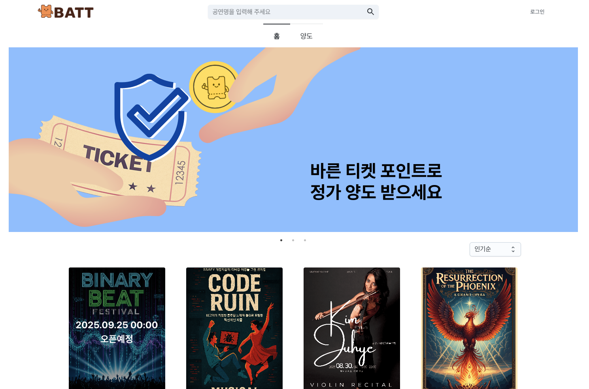
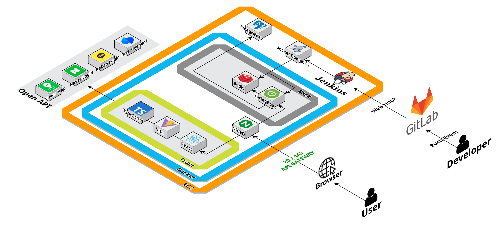
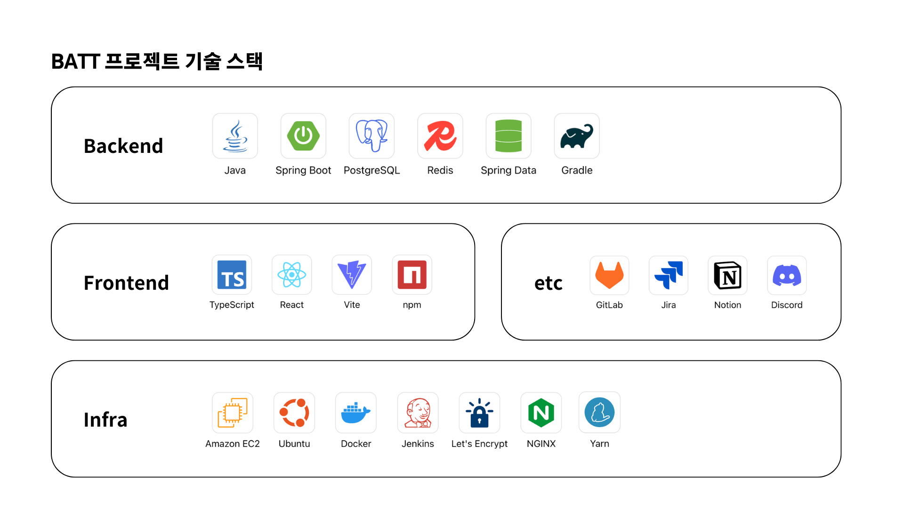

# 🎫 BATT - 암표 방지 문화를 선도하는 예매 플랫폼

## 프로젝트 소개

- 공연과 문화생활을 공정하게 즐기고, 사용하지 못하는 티켓을 안전하게 양도·경매할 수 있는 플랫폼입니다.
- SSE 기술을 활용한 실시간 경매 조회 기능을 통해 입찰가 변동과 낙찰 현황을 즉시 확인하고 참여할 수 있습니다.
- 개인 프로필 페이지에서 참여한 공연 후기, 보유한 컬처코인 등을 관리하고, 판매(양도)하고 싶은 티켓을 등록할 수 있습니다.
- Toss API로 공연 티켓을 간편·안전하게 결제할 수 있으며, 본인인증 절차를 통해 예매한 티켓을 안전하게 활성화하고, 모바일 QR 코드 입장으로 공연 당일 빠르고 편리하게 관람할 수 있습니다.

## `No Conflict` 팀원 구성

|                                                                  팀장 / BE                                                                  |                                                            FE / Mobile                                                             |                                                                FE / Mobile                                                                |
|:-----------------------------------------------------------------------------------------------------------------------------------------:|:----------------------------------------------------------------------------------------------------------------------------------:|:-----------------------------------------------------------------------------------------------------------------------------------------:|
|    [   @Bumnote](https://github.com/Bumnote)     | [   @juhye87](https://github.com/juhye87) | [   @Naling1225](https://github.com/Naling1225) |
|                                                                  **김용범**                                                                  |                                                              **김주혜**                                                               |                                                                  **김나영**                                                                  |
|                                                                  **BE**                                                                   |                                                               **FE**                                                               |                                                                 **Infra**                                                                 |
| [   @justlikesh](https://github.com/justlikesh) | [   @ybt107](https://github.com/ybt107)  |   [   @Hemeiron](https://github.com/Hemeiron)   |
|                                                                  **김승호**                                                                  |                                                              **연지윤**                                                               |                                                                  **김서원**                                                                  |

## 1. 개발 환경

- Front : React, Vite, TypeScript, React Query, Zustand
- Back-end : Spring Boot, Spring Data JPA, Querydsl, PostgreSQL, Redis
- 버전 및 이슈관리 : Gitlab, Jira
- 협업 툴 : Discord, Notion
- 서비스 배포 환경 : AWS EC2, Docker, Nginx, Jenkins CI/CD
- 디자인: [Figma](https://www.figma.com/design/pZKd7c4FbVKbZ53znpoWzA/A506?node-id=2-2&p=f&t=dClHtF36TljvKVul-0)

 

## 2. 시스템 아키텍처 및 사용한 기술 스택

### 시스템 아키텍처

### 기술 스택

 

## 3. 역할 분담

### 🐯 김용범

#### 담당 역할 : 팀장, 백엔드 개발

- 프로젝트 관리 : 스크럼 마스터, Jira 이슈 관리
- 회원 관리 시스템 : 소셜 로그인 기반 Handler, Filter, Resolver, JWT 인증/인가 관리
- 양도 시스템 : SSE 단방향 실시간 통신 기반 양도 경매 등록 및 조회, 입찰 기능
- 양도 마감 스케줄링 시스템 : TaskScheduler 기반 양도 마감 처리
- 컬처 포인트 시스템 : 컬처 포인트 트랜잭션 관리 및 내역 조회
- 리뷰 시스템 : 리뷰 작성, 수정, 조회

### 👻 김승호

#### 담당 역할 : 백엔드 개발

- 공연 관리 시스템 : 공연 정보 조회, 상세 정보, 공연 목록 조회
- 좌석 예매 시스템 : 좌석 선택, 임시 점유, 해제 기능
- 결제 시스템 : 토스페이먼츠 연동, 결제 승인/취소 처리

### 😎 김주혜

#### 담당 역할 : 프론트엔드 개발

- 마이페이지(개인정보 관리, 리뷰 관리, 예매 내역 상세, 코인 내역)
- 양도페이지
- 예매 상세 페이지

### 🐬 김나영

#### 담당 역할 : 프론트엔드 개발

- 프로젝트 발표
- 개발 페이지 및 디자인
    - 공연 예매 페이지(좌석 선택 페이지, 예매자 정보 입력 페이지)
    - 결제 페이지 : 토스페이먼츠 연동 결제 요청 및 처리 및 UI 반영
- 안드로이드
    - 카카오/네이버 SDK 로그인 및 Access Token 관리
    - Retrofit2와 OkHttp를 활용하여 사용자 예매 내역 조회 API 연동

### 😀 연지윤

#### 담당 역할 : 프론트엔드 개발

- UI 개발 및 디자인
    - 페이지 : 메인 페이지, 양도 공연 목록 페이지, 검색 결과 페이지, 로그인 페이지, NotFound 페이지
    - 공통 컴포넌트 : 헤더, 공연 카드

### 😃 김서원

#### 담당 역할 : 인프라

- GitLab Webhook - Jenkins CI/CD 파이프라인 구축
- Docker Compose 기반 멀티 서비스 환경 구성
- Nginx Reverse Proxy + SSL 인증서 적용
- PostgreSQL/Redis 환경 관리

 

## 4. 개발 기간 및 작업 관리

### 개발 기간

- 전체 개발 기간 : 2025-07-01 ~ 2025-08-18
- 기획 및 설계 : 2025-07-01 ~ 2025-07-15
- UI 구현 : 2025-07-12 ~ 2025-07-15
- 기능 구현 : 2025-07-16 ~ 2025-08-17

### 작업 관리

- Jira 이슈 관리 및 대시보드를 활용하여 팀 전체의 작업 진행 상황을 공유했습니다.
- 매일 아침 9시 10분 데일리 스크럼을 진행하여 문제 상황, 진행도, 오늘 할 일 등을 공유하고, Notion 페이지에 스크럼 회의 내용을 기록했습니다.

 

## 5. 페이지별 기능

### [메인페이지]

- 서비스의 초기화면입니다.
- 현재 예매 가능한 공연과, 예매 오픈 대기 중인 공연의 목록을 확인할 수 있는 페이지입니다.
- 한 페이지에 최대 12개의 공연이 보여지며, 정렬 기준(인기순/리뷰 많은순/최신순/공연 임박순)과 페이지 번호를 설정할 수 있습니다.
- 예매 가능한 공연을 클릭하면 해당 공연의 상세 페이지로 이동합니다.
- 아직 예매가 열리지 않은 공연은 포스터에 예매 오픈 예정 일시가 적혀있으며, 클릭해도 상세 페이지로 이동하지 않습니다.

### [공연 상세 페이지]

- 공연의 상세 정보와 공연장 정보, 리뷰 정보를 확인할 수 있습니다.
- 공연 정보 뿐만 아니라, 위치 정보, 관람 후기 정보 또한 확인할 수 있습니다.
- 예매하기 버튼을 클릭하면 예매 페이지로 이동합니다.

### [예매 페이지]

- 공연의 좌석을 선택하고 예매를 진행하는 페이지입니다.
- 한 번에 최대 4개의 좌석을 선택해 예매할 수 있습니다.
- 좌석 선택 후 주문자 정보 확인과 약관 동의 후 토스 페이먼츠 API로 결제가 진행됩니다.

### [양도 공연 목록]

- 티켓 양도가 이루어지는 공연(예매가 진행 중인 공연)의 목록을 보여줍니다.
- 각 공연별로 티켓 양도가 몇 건 이루어지고 있는지 숫자를 확인할 수 있습니다.
- 버튼을 클릭하면 해당 공연에 대한 티켓 양도 목록 페이지로 이동합니다.

### [양도 공연 상세 페이지]

- 공연의 장소, 기간, 티켓 등급 별 가격 등 공연의 개요와 양도 티켓 목록을 확인할 수 있습니다.
- 양도가 진행 중인 티켓은 마감 기한까지 남은 시간을, 마감된 티켓에 대해서는 마감이는 글씨를 보여줍니다.
- 양도 마감까지 남은 시간이 100시간 이상일 경우 남은 날짜를 'D-day'형식으로, 100시간 이하일 때는 "hh:mm:ss" 형식으로 표현합니다.
- 티켓의 "참여하기" 버튼 클릭 시 응모 포인트를 적을 수 있는 모달이 뜨며, 현재 최고 포인트보다 높은 포인트로 응모할 수 있습니다.
- 양도자, 현재 최고 포인트 응모자는 참여할 수 없습니다.

### [검색 결과 페이지]

- 헤더의 검색창에 공연명을 넣고 검색하면 해당 키워드를 포함하는 공연의 목록을 보여주는 페이지입니다.
- 검색 결과가 있을 경우, 공연 정보를 카드에 담아 보여줍니다.
- 검색 결과가 없을 경우, 안내 문구와 메인페이지로 이동하는 버튼을 보여줍니다.

### [마이페이지]

- 개인정보, 예매 내역, 리뷰 내역, BATT(포인트) 내역을 확인할 수 있는 페이지입니다.
- 예매 내역에서는 각 예매 내역을 클릭하여 예매/취소/양도 상태 등 상세 정보를 확인할 수 있습니다.
- 해당 예매의 공연일부터 예매 상세 페이지에서 리뷰를 등록할 수 있습니다.
- 리뷰 상세에서 작성한 리뷰 목록을 확인할 수 있습니다.
- BATT 내역에서 포인트 적립/사용 내역을 확인할 수 있습니다.

### [모바일 QR 코드 페이지 ]

- 예매한 티켓을 모바일 QR 코드로 확인할 수 있는 페이지입니다.
- 암표 방지를 위하여 캡처 방지 기능이 적용되어 있습니다.
- QR 코드를 통해 공연장 입장이 가능합니다.

 

## 6. 신경 쓴 부분

### 1. 토스페이먼츠 외부 API 연동 및 안정성 확보

- Java HTTP Client 직접 활용: Spring WebClient 대신 순수 Java HTTP Client로 토스 API 연동
- 중복 결제 방지: S008 에러 감지 시 checkPaymentStatus() 메서드로 결제 상태 재확인
- Base64 인증: Base64.getEncoder().encodeToString(SECRET_KEY.getBytes())로 인증 헤더 생성
- 예외 처리: API 호출 실패 시 false 반환으로 안전한 fallback

### 2. 좌석 임시 점유 시스템의 Redis 활용

- SeatRedisService 구현: Redis를 활용한 좌석 임시 점유 관리
- TTL 설정: Duration.ofMinutes(10)로 10분간 임시 점유 유지
- Redis와 DB 연계: determineAvailability()에서 Redis 점유 상태와 DB 예약 상태 통합 검증

### 3. 복잡한 좌석 가용성 판단 로직

- 다중 상태 검증: CONFIRMED, TRANSFER_PENDING, Redis 임시 점유 상태를 모두 고려
- 실시간 가용성 확인: 각 좌석마다 개별적으로 가용 여부 계산
- Stream API 활용: seats.stream().map().toList()로 좌석 리스트 변환

### 4. 결제 프로세스의 중복 방지

- 멱등성 보장: findByPaymentKey()로 기존 결제 확인 후 중복 시 기존 결과 반환
- 트랜잭션 관리: @Transactional로 결제 프로세스 원자성 보장

### 5. 공연 상태 자동 업데이트 스케줄러

- @Scheduled 활용: 설정값 기반 주기적 공연 상태 업데이트
- 청크 단위 처리: batchSize로 대량 데이터를 작은 단위로 나누어 처리
- 동적 상태 파싱: Arrays.stream().map().collect()로 검색 조건 파싱

### 6. Spring OAuth2 커스텀 소셜 로그인 및 Spring Security 활용

- OAuth2 Client 활용한 소셜 로그인 구현
- Spring Security 기능을 활용한 Handler, Filter, Resolver 구현
- JWT 토큰 기반 인증/인가 처리(Access Token: Authorization Header, Refresh Token: HttpOnly Cookie)

### 7. 실시간 양도 경매 시스템 구현

- Spring SseEmitter 활용한 SSE 이벤트 스트림 관리 및 단방향 실시간 통신 구현
- TaskScheduler 동적 스케줄링을 활용한 양도 경매 마감 처리 및 낙찰자 선정
- 복잡한 양도 상태 관리 및 트랜잭션 처리

 

## 7. 개선 목표

### 1. 동적 스케줄링 복구 기능 개선

현재 양도 마감 스케줄링은 서버 재시작 시 복구되지 않는 문제가 있습니다. 이를 해결하기 위해 데이터베이스에 스케줄링 정보를 저장하고, 서버 시작 시 이를 읽어와 스케줄링을 복구하는 기능을 구현할
예정입니다.

### 2. 포인트 트랜잭션 & 입찰 기능 동시성 제어

포인트 트랜잭션과 입찰 기능에서 발생할 수 있는 동시성 문제를 해결하기 위해, Named Lock 방식을 활용하여 여러 사용자가 동시에 입찰하거나 포인트를 사용할 때 데이터 일관성을 유지할 수 있도록 개선할
계획입니다.

### 3. 입찰 목록 & 포인트 내역 쿼리 최적화

입찰 목록과 포인트 내역 조회 시 발생하는 N+1 문제를 해결하기 위해, JPA Fetch Join 및 Querydsl을 활용한 쿼리 최적화를 진행할 예정입니다. 이를 통해 데이터베이스 성능을 향상시키고
응답 속도를 개선할 수 있을
것입니다.

### 4. 프론트엔드 성능 개선

- 전송 최적화: 텍스트 자산 Brotli/Gzip 압축, 정적 캐시 정책 적용(`Cache-Control: public, max-age=31536000, immutable`)
- 이미지: AVIF/WebP 전환, `srcset/sizes` 제공, LCP 이미지 `preload`+`fetchpriority=high`, 모든 이미지 `width/height` 명시, 오프스크린
  `loading="lazy"`
- 자바스크립트: 코드 분할(`import()`), 트리셰이킹 및 미사용 코드 제거로 TBT 감소
- 접근성/SEO: 아이콘 버튼 `aria-label` 추가, 메타 설명/`robots.txt` 정정, 404 리소스 정리

 

## 8. 프로젝트 후기

### 🐯 김용범

프로젝트 경험을 어느 정도 해보았지만, 항상 혼자서 백엔드 개발을 해왔기에 같은 백엔드 개발자와 협업하는 경험은 이번이 처음이었습니다. 그러한 상황 속에서 팀장이라는 역할까지 맡게 되어 걱정이 많았지만,
팀원들이 잘 따라와주고
적극적으로 의견을 내주어 무사히 프로젝트를 마칠 수 있었습니다.

새로운 도메인 지식과 사용해보지 않은 기술 스택을 접하여 많은 것을 배울 수 있었고, 좋은 컨설턴트님과 코치님들 덕분에 생각해보지도 못한 부분들을 경험하며 많은 성장을 이룰 수 있었습니다.

팀장의 역할 이전에 한 명의 팀원 또는 개발자로서 이번 프로젝트를 함께한 No-Conflict 팀원 모두에게 감사하다는 말을 전하고 싶습니다. 앞으로의 개발 여정에 행운이 가득하길 바랍니다!

---

### 👻 김승호

항상 개발 공부는 혼자 진행해왔고 누군가의 피드백 또한 받아본 적 없었지만, 공통 프로젝트를 진행하면서 기능 하나를 완성할 때마다 서로의 코드에 대해 피드백을 하며 성장할 수 있었습니다.

내가 짠 코드를 설명하고, 동료 개발자가 짠 코드에 대한 설명을 들으면서 코드 작성 습관과 불필요한 로직 제거, 보다 효율적인 구현 방법에 대해 항상 고민하게 되었습니다.

이러한 협업과 코드 리뷰 과정을 통해 실력이 크게 향상된 것 같아 매우 즐거웠고, 혼자서는 발견하지 못했을 개선점들을 찾을 수 있어 뜻깊은 경험이었습니다.

---

### 😎 김주혜

7주간 프로젝트를 진행하며 모바일 앱 디자인, 본인인증 API 연동, SSE 등 새로운 기술을 경험할 수 있어 즐거웠습니다.

다만 실개발 기간이 짧아 설계를 충분히 하지 못해 프론트엔드 폴더 구조와 코드 스타일을 통일하지 못한 점이 아쉬웠고, 개발 중 계속 헷갈린 용어들을 계기로 용어 사전의 필요성도 많이 느꼈습니다.

서로의 코드를 함께 리뷰하고 책임지는 과정을 통해 더 꼼꼼하게 하려고 노력했던 것 같고 이 과정을 통해 다른 사람의 코드를 읽는 법도 자연스럽게 배우며 성장할 수 있었던 것 같습니다.

7주 동안 함께 밤새워가며 달려준 팀원들, 진심으로 감사합니다!

---

### 🐬 김나영

우선 제가 제안했던 주제로 프로젝트를 진행할 수 있어 좋았습니다! 평소 관심있었던 분야였었는데 재밌게 작업하였습니다.
더불어, SSE나 결제 관련 기능 등 다양한 기능을 접하고 구현해봐서 좋았고 앞으로의 프로젝트에서도 도움이 될 것 같습니다.

좀 완벽하게 진행하고 싶다보니 처음에 파일 구조부터 신경을 많이 쓰느라 시간을 많이 쓴 것이 아쉬웠습니다. 그래도 한 번 해봤으니 다음에는 JIRA를 더 잘 활용해서 시간을 절약할 수 있을 것 같습니다.

다음 프로젝트에는 좀 더 객체지향적으로 재사용 가능한 코드를 작성하고 싶습니다. 또한 기능 구현과 더불어 디자인도 신경을 많이 써서 UI/UX를 발전시키고 싶습니다.

---

### 😀 연지윤

프로젝트가 끝나고 되돌아보니 부족한 저의 능력에 아쉬운 것도 많지만 스스로 성장했다고 느꼈던 뿌듯한 기억도 많고, 소통의 중요성, 기록의 중요성 등 배운 것도 많습니다. 처음엔 팀에 폐를 끼치지 않겠다는
마음으로 임했는데, 옆에서
격려해준 팀원들 덕분에 저도 저를 믿고 열심히 해 볼 수 있었습니다. 같은 목표를 향해 7주간 같이 달려준 팀원들 모두 감사했고 수고 많으셨습니다!

---

### 😃 김서원

이번 프로젝트에서는 익숙하지 않은 인프라 파트에 도전하며 Jenkins 기반 CI/CD 파이프라인 구축과 SSL 적용 등 실무적인 경험을 많이 쌓을 수 있었습니다.

인프라 담당으로서 느낀 점은, 단순한 서버 설정을 넘어서 형상관리 도구 활용, 팀 기술 스택 전반에 대한 이해, 그리고 프로젝트 구조에 대한 명확한 파악이 필수적이라는 것이었습니다.

인프라 구축 과정을 꼼꼼히 문서화하려다보니 초반에는 작업 속도가 더뎌보여 기록의 필요성에 대해 고민하기도 했습니다.

하지만 이후 동일 작업 재진행, 포팅 메뉴얼 작성 등에 큰 도움이 되며 기록의 중요성을 다시 한 번 체감했습니다.

협업 측면에서는, 유능한 팀장님을 만나 Jira를 통한 프로젝트 관리와 팀 컨벤션의 체계적인 적용 등을 배우며 개발 과정에서의 협업 문화를 깊이 이해할 수 있었습니다.

No-Conflict라는 팀명처럼, 서로 배려하고 부족한 부분도 이해해주고 격려해주는 분위기 덕분에 프로젝트를 잘 마무리할 수 있었다고 생각합니다.

좋은 팀원들을 만나게 되어서, 그리고 인프라 담당으로 6인 규모의 프로젝트에서 배포 경험을 쌓을 수 있어서 감사했습니다.